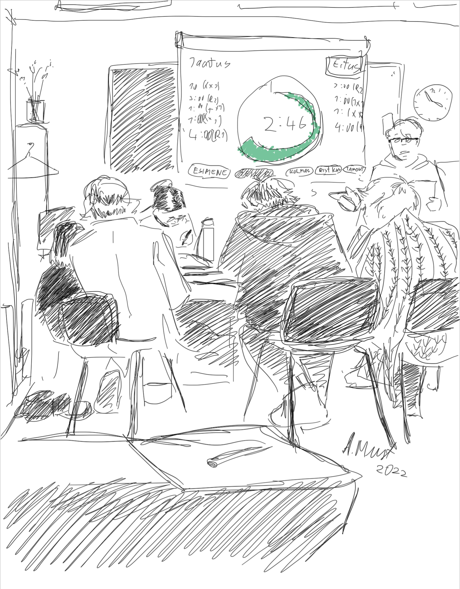

# debating-timer
Circular debating timer with rounds, custom intervals, visual/audio warnings, timeouts and history logging. Initially created to be used at online [Philosophy Olympiad](https://et.wikipedia.org/wiki/Filosoofiaol%C3%BCmpiaad) in COVID-19 restricted circumstances.

See in action at:

* https://infoaed.ee/taimer

## Image credits

* In action at [Estonian Philosophy Olympiad 2022](https://www.facebook.com/flolympiaad/posts/4771271499650306): CC BY Adeele Must
* Timer SVG: [Mateusz Rybczonec](https://css-tricks.com/how-to-create-an-animated-countdown-timer-with-html-css-and-javascript/)

## Audio credits

* CC0 [plasterbrain](https://freesound.org/people/plasterbrain/sounds/243020/)
* CC0 [insanity54](https://freesound.org/people/insanity54/sounds/349655/)
* CC0 [mafon2](https://freesound.org/people/Mafon2/sounds/377552/)
* CC0 [Breviceps](https://freesound.org/people/Breviceps/sounds/450617/)
* CC BY-SA [StevenBrown](https://freesound.org/people/StevenBrown/sounds/128430/)
